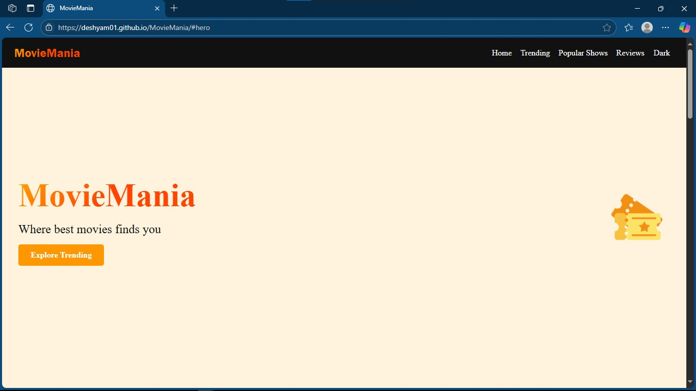
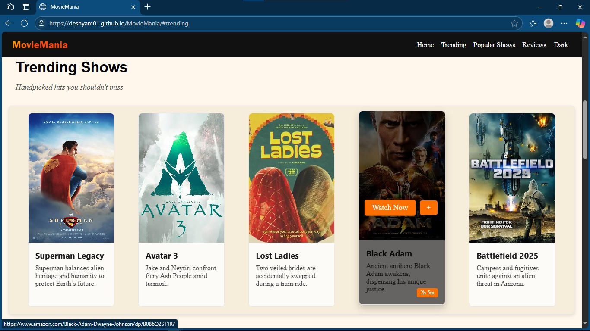

<h1 align="center">🎬 MovieMania</h1>
<p align="center">Where the best movies find you</p>

<p align="center">
  <a href="https://deshyam01.github.io/MovieMania/" target="_blank">
    
  </a>
</p>

---

## 📌 Overview

**MovieMania** is a stylish front-end movie showcase website built using only **HTML** and **CSS**. It features a clean card-based layout, responsive design, and theme toggle — all crafted without any JavaScript. The site offers a curated list of trending shows and lets users visit external pages for more details.

---

## ✨ Features

- 🎞️ Trending movie cards with hover effects
- 🧭 Smooth navigation between sections
- 🌘 CSS-only dark mode toggle
- 🔗 Clickable movie links to official/external sites
- 📱 Mobile-first responsive layout

---

## 📸 Screenshots

### 🏠 Landing Page


### 🔥 Trending Shows


---

## 🛠 Tech Stack

| Technology | Description                  |
|------------|------------------------------|
| HTML5      | Markup structure             |
| CSS3       | Styling, layout, responsiveness |
| No JS      | Built entirely without JavaScript |

---

## 🚀 Getting Started

### 🔗 Live Preview

[https://deshyam01.github.io/MovieMania/](https://deshyam01.github.io/MovieMania/)

### 🧑‍💻 Run Locally

```bash
git clone https://github.com/deshyam01/MovieMania.git

cd MovieMania
```
open index.html in any browser
